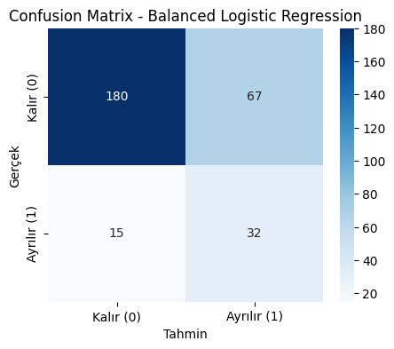

# Employee Attrition Prediction

Bu projede, çalışanların işten ayrılma (`attrition`) durumunu tahmin etmeye yönelik bir makine öğrenmesi modeli geliştirilmiştir.

Bu çalışma, [Tech İstanbul](https://tech.istanbul/v2/tr/) tarafından düzenlenen 
[Makine Öğrenmesi Bootcamp](https://tech.istanbul/v2/tr/etkinlik/makine-ogrenmesi-bootcamp/) kapsamında tamamlanmıştır.

Eğitim süreci boyunca değerli bilgi ve deneyimlerini paylaşan, anlatımlarıyla destek olan 
**[Deniz Alkan](https://www.linkedin.com/in/deniz-alkan/)**’a teşekkürlerimi sunarım.

## Kullanılan Yöntemler
- Veri analizi ve ön işleme
- Kategorik değişkenlerin one-hot encode edilmesi
- Sınıf dengesizliği (class imbalance) analizi
- Logistic Regression modeli ile tahmin
- Dengeli sınıf ağırlıkları (`class_weight='balanced'`)
- Confusion matrix ve performans metrikleri
- Karar eşiği (threshold) analizi
- Çalışan bazlı tahmin fonksiyonu

## Veri Seti
Bu projede, Kaggle üzerinde paylaşılan [IBM HR Analytics Employee Attrition Dataset](https://www.kaggle.com/datasets/pavansubhasht/ibm-hr-analytics-attrition-dataset) kullanılmıştır.

## Amaç
İnsan Kaynakları departmanları için, çalışan kaybı riskini öngörebilmeye yönelik bir erken uyarı ve karar destek sistemi oluşturmak.

## Model Performansı

Aşağıda, dengeli Logistic Regression modeline ait confusion matrix yer almaktadır.


> Model, özellikle işten ayrılan çalışanları tespit etme başarısını (recall) artıracak şekilde yapılandırılmıştır.

## Örnek Çıktı

### Yüksek Seviyeli Risk

Input:
```python
employee_high_risk = {
    "Age": 26,
    "MonthlyIncome": 1500,
    "JobSatisfaction": 1,
    "OverTime_Yes": 1
}
```

Output:
```json
{
    'Tahmin': 'Ayrılır',
    'Risk Seviyesi': 'Yüksek',
    'Ayrılma Olasılığı (%)': 58.08
}
```

---

### Orta Seviyeli Risk

Input:
```python
employee_medium_risk = {
    "Age": 34,
    "MonthlyIncome": 6000,
    "JobSatisfaction": 2,
    "OverTime_Yes": 1
}
```
Output:
```json
{
    'Tahmin': 'Kalır', 
    'Risk Seviyesi': 'Orta', 
    'Ayrılma Olasılığı (%)': 49.12
}
```

---

### Düşük Seviyeli Risk

Input:
```python
employee_low_risk = {
    "Age": 45,
    "MonthlyIncome": 9000,
    "JobSatisfaction": 4,
    "OverTime_Yes": 0
}
```

Output:
```json
{
    'Tahmin': 'Kalır', 
    'Risk Seviyesi': 'Düşük', 
    'Ayrılma Olasılığı (%)': 24.62
}
```